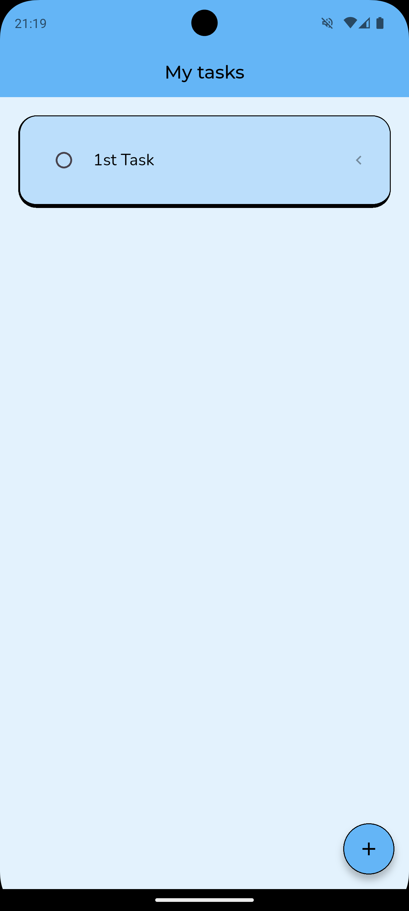
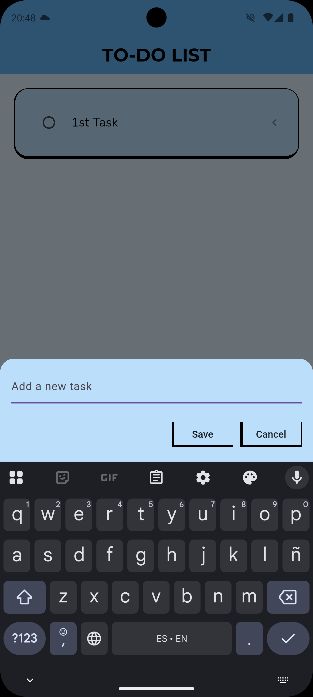
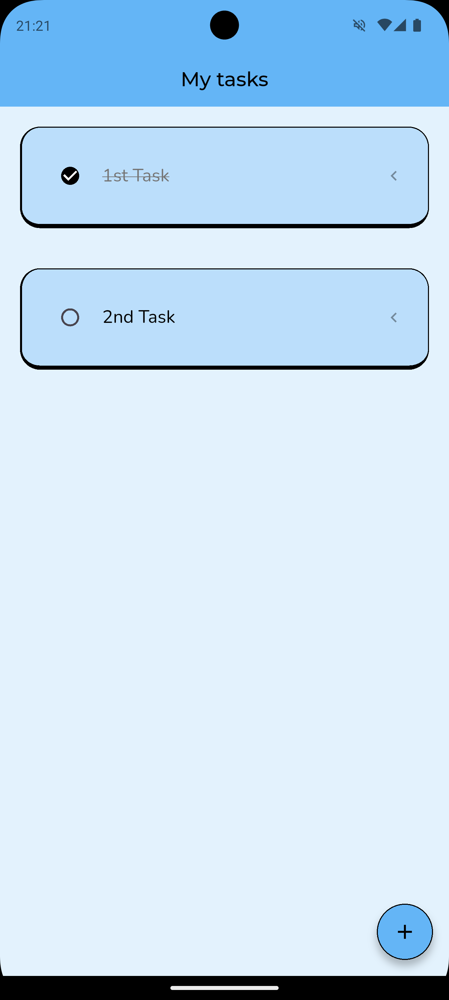
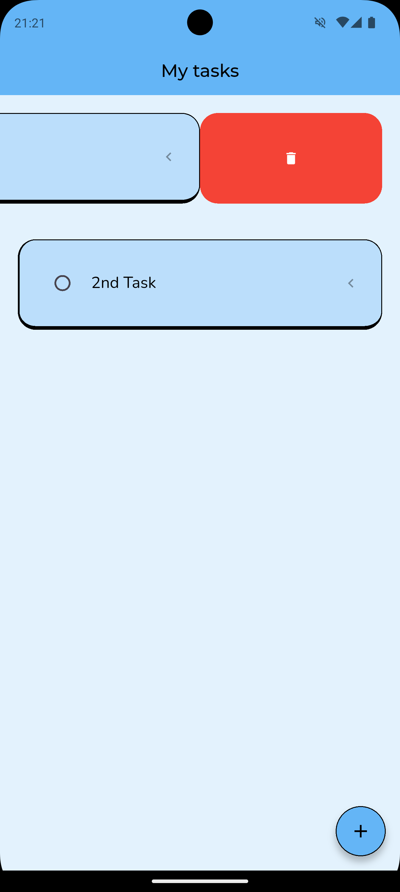

# Flutter To-Do App 📝

A simple and clean To-Do application built with Flutter.  
It allows users to manage daily tasks with smooth animations and local persistence.

---

## ✨ Features

- Add new tasks
- Mark tasks as completed
- Animated strikethrough when completing tasks
- Swipe to delete tasks
- Local data persistence using Hive
- Clean and minimal UI

---

## 📸 Screenshots

### Home Screen

### Add New Task

### Complete Task

### Swipe to Delete

---
## 🛠 Tech Stack

- Flutter
- Dart
- Hive (local storage)
- flutter_slidable
- google_fonts

